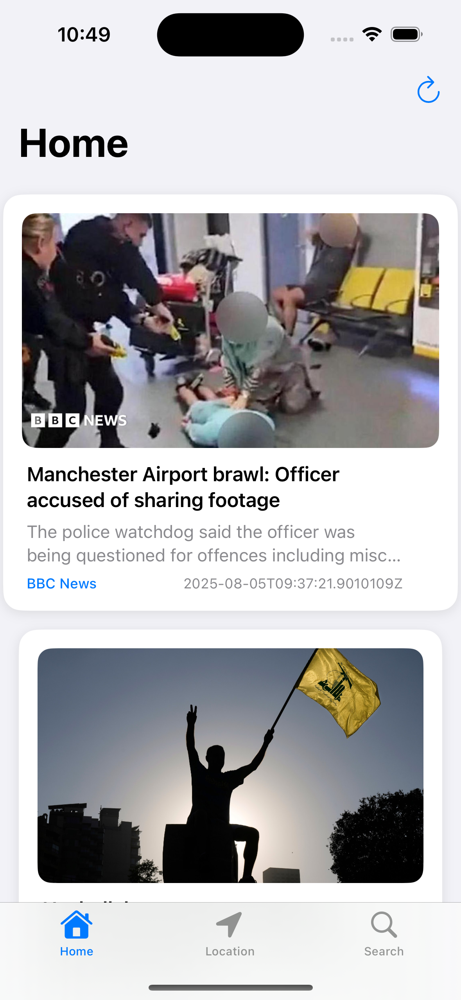
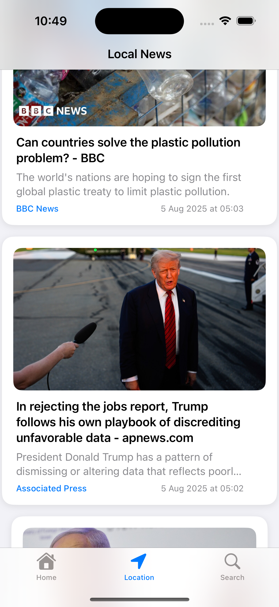
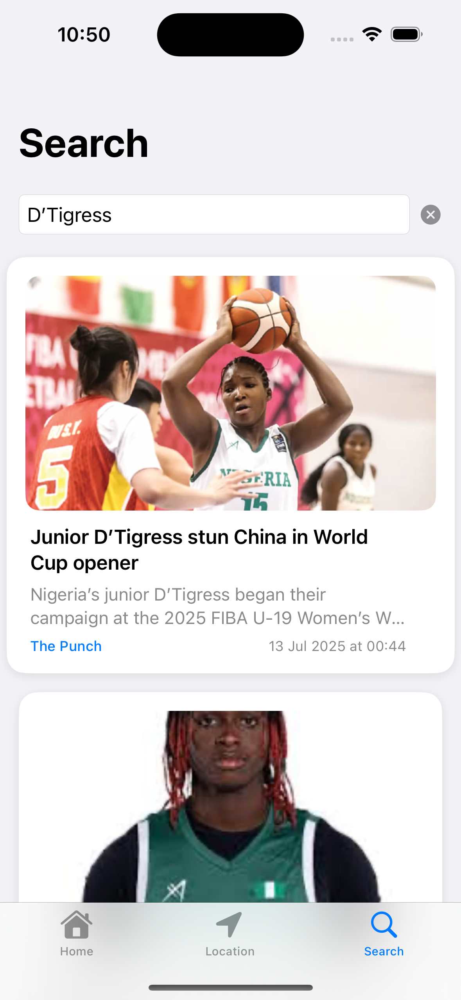

# 📰 NewsApp with SwiftUI

A simple and clean news app built using **SwiftUI**. This project fetches and displays the latest headlines from a news API, showcasing SwiftUI’s power for building reactive interfaces with minimal code.

## ✨ Features
- Modern SwiftUI interface
- List of trending headlines
- Article detail view with full content
- Asynchronous image loading
- Clean architecture with MVVM
- Error handling and loading states

## 🧪 Built With
- SwiftUI
- Combine
- URLSession
- MVVM pattern

## 📸 Screenshots
<table>
  <tr>
    <td></td>
    <td></td>
    <td></td>
    <td></td>
  </tr>
</table>

## 📦 Installation
1. Clone the repo  
```bash
git clone https://github.com/inijones/newsapp_swiftui.git
```
2. Open NewsApp.xcodeproj in Xcode

3. Run on iOS Simulator or a real device (iOS 15+)


